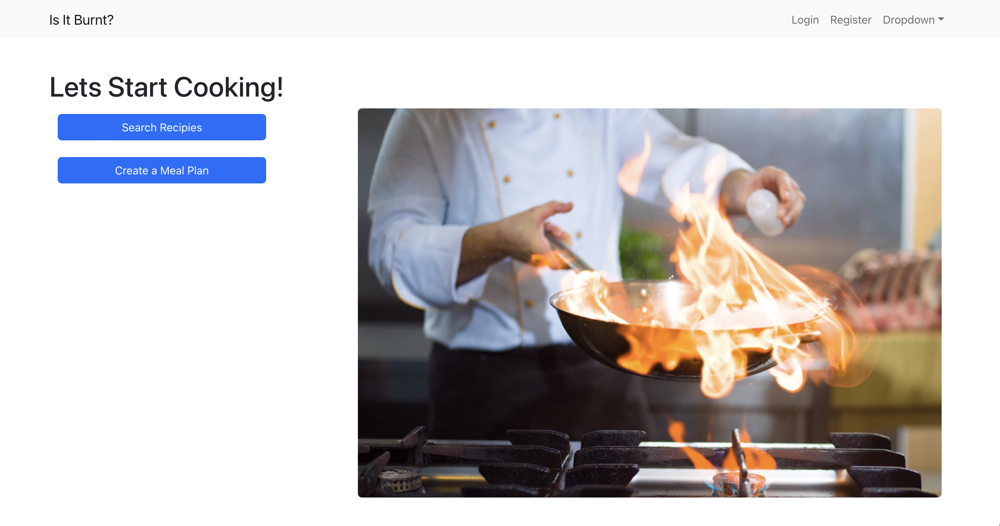
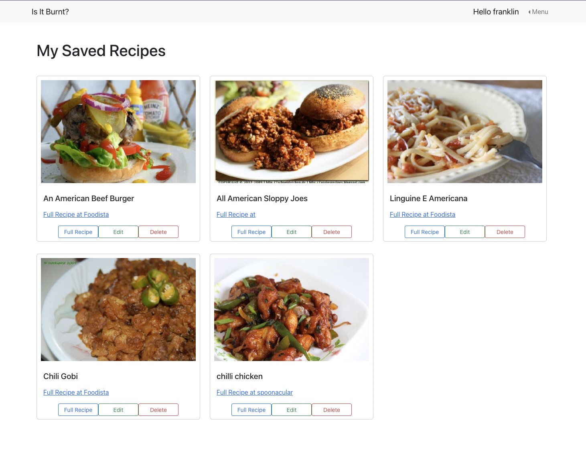
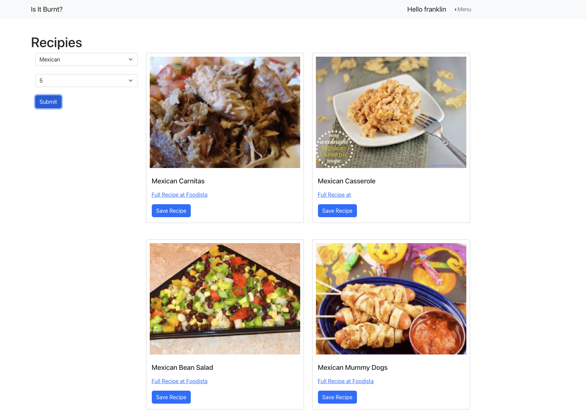

# Is It Burnt?
>A recipe app for everyday use

## Table of Contents

* [Info](#info)
* [Project Demo](#project-demo)
* [Project Video](#project-video)
* [Technologies](#technologies)
* [Setup](#setup)
* [Features](#features)
* [Inspiration](#inspiration)
* [Contact](#contaact)

## Info
Is It Burnt is an easy to use web application designed to allow users to create an account and search and save recipes to their profile.

Is It Burnt

</kbd>
<kbd>

</kbd>

<kbd>

</kbd>

## Project Demo

Deployment Coming Soon

## Project Video

Project Video Coming Soon

## Technologies

### Frontend
*
*
*
*
*
*

### Backend
*
*
*
*
*
*

## Setup

## Features

## Inpiration

## Contact
Created by [Eric Horn](www.linkedin.com/in/eric-horn-60143454)
Contact me with any questions